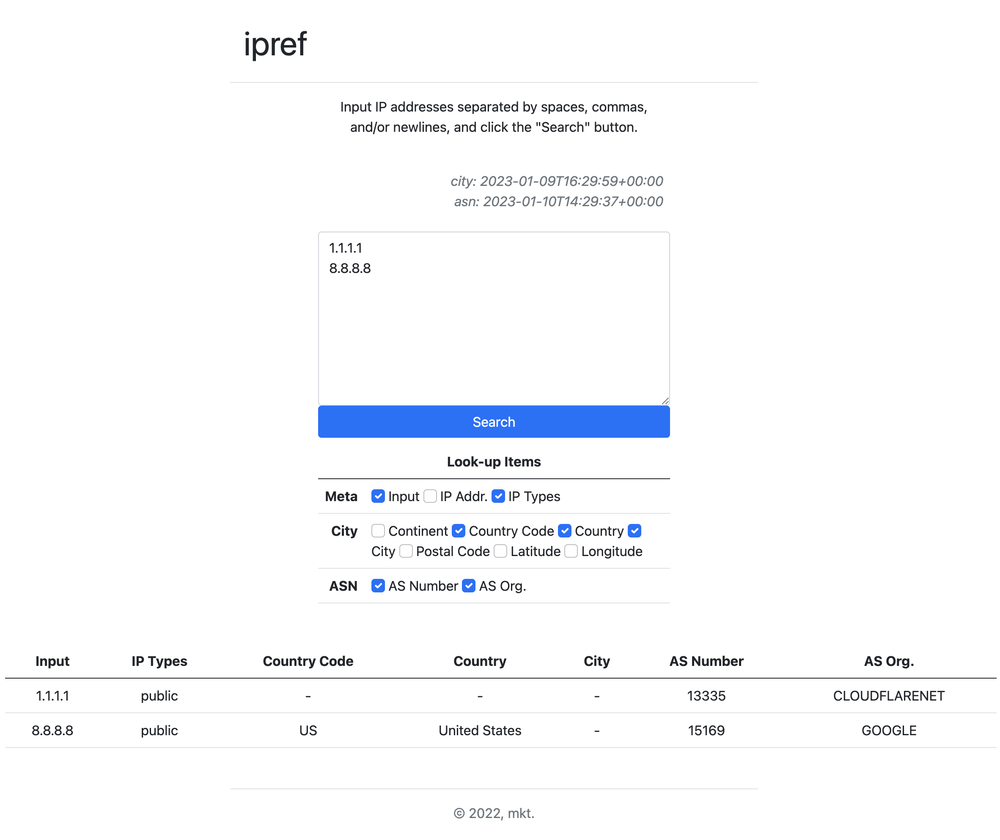

# ipref

`ipref-py` is a simple utility to look up IP addresses in MaxMind's GeoIP
downloadable databases by CLI and web.

I often look up geolocation data of a number of IP addresses in my research,
but existing tools do not satisfy this need.

Note that the web interface must be used for internal use only such as your own
environment and your lab. If you make it public, it can be abused for attackers
and also violates terms of use by maxmind.

Main features:

- Look up IP addresses by MaxMind's GeoIP databases.
- Look up hostnames of IP addresses by DNS reverse lookup.
- A command line and a simple web interface.
- Flexible outputs (JSON, JSON-Lines, CSV, TSV).
- Configuration by YAML files.


## Requirements

- Python 3.7-
- Linux or macOS (It may work in Windows but I have not checked yet.)


## Installation

(Optional, but recommended) Create virtualenv environment.

```sh
$ cd /path/to/some/dir/
$ python3 -m venv env
$ source env/bin/activate
```

Download .whl file from [GitHub release](https://github.com/md-irohas/ipref-py/releases) page.

```sh
(env) $ wget https://github.com/md-irohas/ipref-py/releases/download/v0.1.0/ipref-0.1.0-py3-none-any.whl

# if you want CLI only
(env) $ pip install ipref-0.1.0-py3-none-any.whl

# if you want CLI and web interface
(env) $ pip install ipref-0.1.0-py3-none-any.whl[web]
```


## Configuration

Next, make configuration file.
Configuration files are loaded from the following paths:

- `~/.config/ipref.yaml`
- `~/.config/ipref.yml`
- `~/.ipref.yaml`
- `~/.ipref.yml`
- (environment variable `IPREF_CONF`)
- (command line argument [CLI only])

The latter file overwrites the former one.

```sh
# Copy configuration from https://github.com/md-irohas/ipref-py/blob/main/ipref/config.yaml.orig and edit it.
$ vim ~/.config/ipref.yaml
...(edit)...
```


## CLI Example

### Usage

```sh
$ ipref --help

usage: ipref [-h] [-v] [-d] [-c CONFIG] [-I {ip,file}]
             [-O {tsv,json,jsonl,csv}] [--csv-columns CSV_COLUMNS]
             [--csv-exclude-header] [--csv-escape-comma]
             [items ...]

positional arguments:
  items                 IP addresses or filenames. if input_type is file and
                        the items are empty, stdin is used. (default: None)

options:
  -h, --help            show this help message and exit
  -v, --version         show version and exit.
  -d, --debug           enable debug logging to stderr. (default: False)
  -c CONFIG, --config CONFIG
                        path to config file. (default: None)
  -I {ip,file}, --input-type {ip,file}
                        input type. (default: ip)
  -O {tsv,json,jsonl,csv}, --output-format {tsv,json,jsonl,csv}
                        output format. (default: json)
  --csv-columns CSV_COLUMNS
                        [csv|tsv] output columns separated by comma (,).
                        (default: None)
  --csv-exclude-header  [csv|tsv] exclude a csv header. (default: False)
  --csv-escape-comma    [csv|tsv] replace commas (,) to <comma> (useful when
                        using commands such as 'cut'). (default: False)
```


### Example-1: First step

The following example looks up "1.1.1.1" and "8.8.8.8" from command line and dump the results as CSV format.

```sh
$ ipref -O csv "1.1.1.1" "8.8.8.8"
meta.raw_input,meta.ip_address_types,geoip.city.continent.names.en,geoip.city.country.iso_code,geoip.city.country.names.en,geoip.city.city.names.en,geoip.city.postal.code,geoip.city.location.latitude,geoip.city.location.longitude,geoip.asn.autonomous_system_number,geoip.asn.autonomous_system_organization
1.1.1.1,public,,,,,,,,13335,CLOUDFLARENET
8.8.8.8,public,North America,US,United States,,,37.751,-97.822,15169,GOOGLE
```


### Example-2: Flexible output

You can specify columns to be printed in CSV/TSV formats.
See `output.columns` section in `config.yaml.orig` for the list of column names.

```sh
$ ipref -O csv --csv-columns meta.raw_input,geoip.city.country.name "1.1.1.1" "8.8.8.8"
meta.raw_input,geoip.city.country.name
1.1.1.1,
8.8.8.8,United States
```

You can also set columns in the configuration file.


### Example-3: Bulk search

To look up a number of IP addresses, you can pass them through files.

```sh
# from stdin
$ cat ip-list.txt | ipref -O csv

# from files
$ ipref -I file -O csv file1.txt file2.txt ...
```


## Web Example

A simple web app is also avaialble.




### Example-4: Launch web app

Launch ipref-web from command line and access http://localhost:5000/ .
A simple web interface like the above figure is shown.

```sh
$ IPREF_CONF="/path/to/config.yaml" ipref-web run
```

The "Look-up Items" are configurable. Input IP addresses, set checkboxes, and click "Search" button!


### Example-5: Run as production WSGI app 

Use gunicorn to run ipref-web as production WSGI app.

```sh
$ gunicorn "ipref.web:create_app()"
```


## Alternatives

- mmdbinspect: https://github.com/maxmind/mmdbinspect (Official command-line lookup tool)
- geoiplookup


## License

MIT License ([link](https://opensource.org/licenses/MIT)).


## Contact

md (E-mail: md.irohas at gmail.com)


